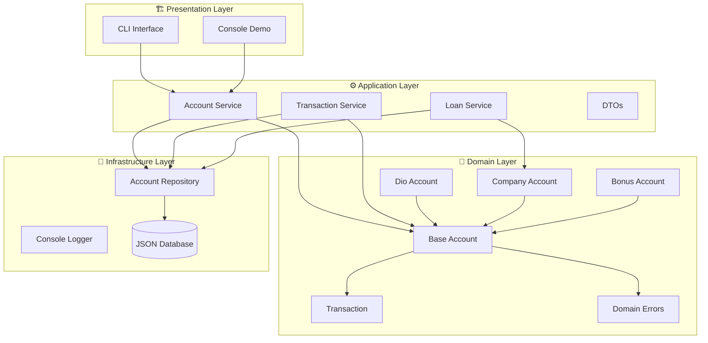
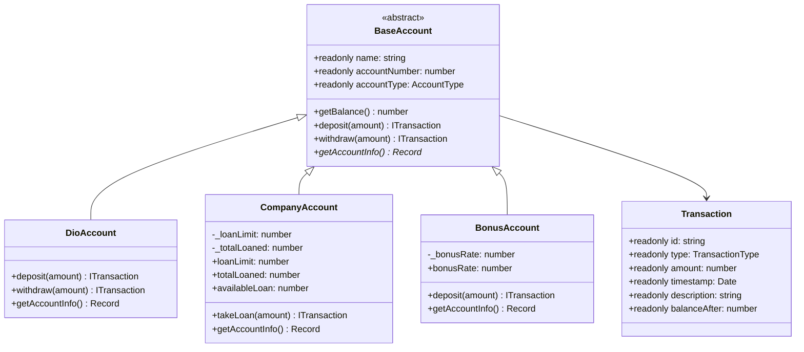

<div align="center">


<br><br>

<!-- Dynamic Typing Effect -->
<a href="https://git.io/typing-svg">
  
</a>

<br><br>

<!-- Neon Badges Row -->
<p align="center">
  <a href="https://www.typescriptlang.org/">
    
  </a>
  <a href="https://nodejs.org/">
    
  </a>
  <a href="https://vitest.dev/">
    
  </a>
  <a href="https://github.com/features/actions">
    
  </a>
</p>

<p align="center">
  <a href="https://eslint.org/">
    
  </a>
  <a href="https://prettier.io/">
    
  </a>
  <a href="./LICENSE">
    
  </a>
  <a href="https://www.dio.me/">
    
  </a>
</p>

<br>

<!-- GitHub Stats Cards -->


<br><br>

<!-- Profile Trophy -->


</div>

---

<br>

<div align="center">

## 🎬 Live Demo


</div>

<br>

---

## 🏛️ Architecture Overview



<br>

---

## ✨ Features Matrix

<div align="center">

<table>
<thead>
<tr>
<th width="30%">🏦 Account Types</th>
<th width="30%">💰 Transactions</th>
<th width="30%">🛡️ Validations</th>
</tr>
</thead>
<tbody>
<tr>
<td>

| Feature | Status |
|---------|--------|
| Personal Account | ✅ |
| Company Account | ✅ |
| Bonus Account (+10%) | ✅ |
| Account Activation | ✅ |
| Account Deactivation | ✅ |

</td>
<td>

| Feature | Status |
|---------|--------|
| Deposit | ✅ |
| Withdraw | ✅ |
| Loan (Business) | ✅ |
| Transaction History | ✅ |
| Bonus on Deposit | ✅ |

</td>
<td>

| Validation | Error |
|------------|-------|
| Negative Amount | ❌ |
| Insufficient Funds | ❌ |
| Inactive Account | ❌ |
| Closed Account | ❌ |
| Loan Not Allowed | ❌ |

</td>
</tr>
</tbody>
</table>

</div>

<br>

---

## 🧪 Test Coverage

<div align="center">


<br><br>

<!-- Test Grid -->
<table width="90%">
<tr>
<td width="33%" valign="top">

### 📝 Unit Tests

- ✅ `DioAccount` — 10 tests
- ✅ `CompanyAccount` — 6 tests  
- ✅ `BonusAccount` — 6 tests
- ✅ `AccountService` — 8 tests
- ✅ `TransactionService` — 5 tests
- ✅ `LoanService` — 4 tests

</td>
<td width="33%" valign="top">

### 🎯 Test Patterns

- 🔄 Arrange → Act → Assert
- 🎭 Isolated with `beforeEach`
- 📦 Dependency Injection
- 🎨 Domain Error Testing
- 🧩 Mock Repositories

</td>
<td width="33%" valign="top">

### 📊 Quality Metrics

| Metric | Value |
|--------|-------|
| Total Tests | 39 |
| Passing | 39 |
| Failing | 0 |
| Type Errors | 0 |
| Lint Warnings | 0 |

</td>
</tr>
</table>

</div>

<br>

---

## 🚀 Quick Start

<div align="center">

<!-- Terminal Style Code Block -->

```bash
# 🚀 Clone the repository
git clone https://github.com/matheusflorindo32/dio-bank-pro.git

# 📁 Navigate to project
cd dio-bank-pro

# 📦 Install dependencies
npm install

# ▶️ Run the application
npm run dev

# 🧪 Run tests
npm test

# 🧪 Run tests with coverage
npm run test:coverage
```

</div>

<br>

---

## 📊 Performance & Quality

<div align="center">

<!-- GitHub Stats -->


<br><br>

<!-- Language Stats -->


</div>

<br>

---

## 🔧 Tech Stack

<div align="center">

<!-- Skill Icons Grid -->


<br><br>

<!-- Additional Tools -->


</div>

<br>

---

## 📈 Comparison: Original vs Pro

<div align="center">

<table width="90%">
<thead>
<tr>
<th width="25%">Aspect</th>
<th width="30%">Original Challenge</th>
<th width="35%">🏆 DIO Bank Pro</th>
</tr>
</thead>
<tbody>
<tr>
<td><b>Architecture</b></td>
<td>Single Script</td>
<td>✨ Clean Architecture (4 Layers)</td>
</tr>
<tr>
<td><b>OOP</b></td>
<td>Basic Classes</td>
<td>✨ Abstraction, Inheritance, Polymorphism</td>
</tr>
<tr>
<td><b>TypeScript</b></td>
<td>Standard Config</td>
<td>✨ Strict Mode, No Implicit Any</td>
</tr>
<tr>
<td><b>Testing</b></td>
<td>None</td>
<td>✨ 39 Automated Tests</td>
</tr>
<tr>
<td><b>CI/CD</b></td>
<td>None</td>
<td>✨ GitHub Actions</td>
</tr>
<tr>
<td><b>Documentation</b></td>
<td>Minimal</td>
<td>✨ Full Technical Docs + Diagrams</td>
</tr>
<tr>
<td><b>Error Handling</b></td>
<td>Console.log</td>
<td>✨ Domain Errors with Codes</td>
</tr>
<tr>
<td><b>Logging</b></td>
<td>None</td>
<td>✨ Structured Console Logger</td>
</tr>
<tr>
<td><b>Code Quality</b></td>
<td>Basic</td>
<td>✨ ESLint + Prettier + Type Strict</td>
</tr>
</tbody>
</table>

</div>

<br>

---

## 🗂️ Project Structure

<div align="center">

```
🌳 dio-bank-pro
├── 📂 src/
│   ├── 💎 domain/              ← Core Business Logic
│   │   ├── 🏦 entities/
│   │   │   ├── 📄 BaseAccount.ts
│   │   │   ├── 📄 DioAccount.ts
│   │   │   ├── 📄 CompanyAccount.ts
│   │   │   ├── 📄 BonusAccount.ts
│   │   │   └── 📄 Transaction.ts
│   │   ├── 🗄️ repositories/
│   │   │   └── 📄 IAccountRepository.ts
│   │   └── ⚠️ errors/
│   │       └── 📄 DomainError.ts
│   │
│   ├── ⚙️ application/         ← Use Cases & Services
│   │   ├── 📄 AccountService.ts
│   │   ├── 📄 TransactionService.ts
│   │   ├── 📄 LoanService.ts
│   │   └── 📂 dto/
│   │       └── 📄 AccountDTOs.ts
│   │
│   ├── 🔧 infrastructure/    ← Technical Implementations
│   │   ├── 🗄️ repositories/
│   │   │   └── 📄 AccountRepository.ts
│   │   └── 📝 logger/
│   │       └── 📄 ConsoleLogger.ts
│   │
│   ├── 🎨 presentation/      ← User Interfaces
│   │   └── 📄 BankConsole.ts
│   │
│   └── 📂 shared/            ← Utilities
│       ├── 📂 enums/
│       ├── 📂 types/
│       └── 📂 utils/
│
├── 🧪 tests/                 ← Test Suite
├── 📚 docs/                  ← Technical Documentation
├── 🎨 assets/                ← Visual Assets
└── ⚙️ configs                ← TypeScript, ESLint, Vitest
```

</div>

<br>

---

## 🎨 Class Diagram

<div align="center">



</div>

<br>

---

## 📦 Available Scripts

<div align="center">

<table width="80%">
<tr>
<td>

| Command | Description |
|---------|-------------|
| `npm run dev` | 🚀 Run development mode |
| `npm run build` | 📦 Build for production |
| `npm start` | ▶️ Start production build |
| `npm test` | 🧪 Run all tests |
| `npm run test:watch` | 👀 Run tests in watch mode |
| `npm run test:coverage` | 📊 Generate coverage report |
| `npm run lint` | 🔍 Run ESLint |
| `npm run lint:fix` | 🔧 Fix ESLint issues |
| `npm run format` | ✨ Format with Prettier |
| `npm run typecheck` | ✅ Check TypeScript types |
| `npm run clean` | 🗑️ Clean dist folder |

</td>
</tr>
</table>

</div>

<br>

---

## 🧩 Code Examples

<details>
<summary><b>🏦 Creating Accounts</b> — Click to expand</summary>

```typescript
import { AccountService } from './src/application/services/AccountService'
import { AccountRepository } from './src/infrastructure/repositories/AccountRepository'

const service = new AccountService(new AccountRepository())

// Personal Account
const personal = service.createAccount({
  name: 'João Silva',
  accountType: 'PERSONAL',
  initialBalance: 1000
})

// Company Account
const company = service.createAccount({
  name: 'Tech Solutions',
  accountType: 'COMPANY'
})

// Bonus Account (+10% on deposits)
const bonus = service.createAccount({
  name: 'Maria Santos',
  accountType: 'BONUS'
})
```

</details>

<details>
<summary><b>💰 Transactions</b> — Click to expand</summary>

```typescript
import { TransactionService } from './src/application/services/TransactionService'

const txService = new TransactionService(repository)

// Deposit
txService.deposit({ accountNumber: 123456, amount: 500 })

// Withdraw
txService.withdraw({ accountNumber: 123456, amount: 200 })

// Check balance
const balance = txService.getBalance(123456)

// Transaction history
const history = txService.getTransactionHistory(123456)
```

</details>

<details>
<summary><b>💼 Business Loans</b> — Click to expand</summary>

```typescript
import { LoanService } from './src/application/services/LoanService'

const loanService = new LoanService(repository)

// Only CompanyAccount can take loans
loanService.takeLoan({ accountNumber: 100001, amount: 3000 })

// Check loan info
const info = loanService.getLoanInfo(100001)
console.log(info.availableLoan) // Remaining limit
```

</details>

<details>
<summary><b>🎁 Bonus Account</b> — Click to expand</summary>

```typescript
// BonusAccount adds +10% on every deposit
const bonusAccount = service.createAccount({
  name: 'Maria Santos',
  accountType: 'BONUS'
})

service.activateAccount(bonusAccount.accountNumber)

// Deposit 500 → Balance becomes 550 (bonus: 50)
bonusAccount.deposit(500)
console.log(bonusAccount.getBalance()) // 550
```

</details>

<br>

---

## 🏆 Challenge Requirements

<div align="center">

<table width="80%">
<tr>
<th width="50%">Requirement</th>
<th width="20%">Status</th>
<th width="30%">Implementation</th>
</tr>
<tr>
<td>Deposit & Withdraw methods in DioAccount</td>
<td>✅</td>
<td><code>BaseAccount.deposit()</code> & <code>withdraw()</code></td>
</tr>
<tr>
<td>Withdraw only for active accounts with balance</td>
<td>✅</td>
<td><code>validateOperation()</code> checks status & balance</td>
</tr>
<tr>
<td>Loan in CompanyAccount</td>
<td>✅</td>
<td><code>CompanyAccount.takeLoan()</code></td>
</tr>
<tr>
<td>Loan only for active accounts</td>
<td>✅</td>
<td>Validation before loan processing</td>
</tr>
<tr>
<td>New account type with +10% deposit bonus</td>
<td>✅</td>
<td><code>BonusAccount</code> with <code>bonusRate = 0.1</code></td>
</tr>
<tr>
<td>All attributes private</td>
<td>✅</td>
<td>TypeScript <code>private</code> modifier</td>
</tr>
<tr>
<td>Immutable name and accountNumber</td>
<td>✅</td>
<td>TypeScript <code>readonly</code></td>
</tr>
<tr>
<td>Instances and execution in app.ts</td>
<td>✅</td>
<td><code>src/main.ts</code> & <code>BankConsole.ts</code></td>
</tr>
</table>

</div>

<br>

---

## 📚 Documentation

<div align="center">

<table width="80%">
<tr>
<td width="25%" align="center">

<a href="./docs/architecture.md">

</a>

</td>
<td width="25%" align="center">

<a href="./docs/class-diagram.md">

</a>

</td>
<td width="25%" align="center">

<a href="./docs/decisions.md">

</a>

</td>
<td width="25%" align="center">

<a href="./docs/roadmap.md">

</a>

</td>
</tr>
</table>

</div>

<br>

---

## 👨‍💻 Author

<div align="center">


<br><br>

**Matheus Florindo de Deus**

💻 Full Stack Developer | 🎖️ Military Police | 📚 Researcher

<br>

<a href="https://github.com/matheusflorindo32">
  
</a>
<a href="https://www.linkedin.com/in/matheus-florindo-de-deus-b953b017a/">
  
</a>
<a href="mailto:matheusdideusf@gmail.com">
  
</a>

<br><br>

<!-- Profile Views -->


</div>

<br>

---

<div align="center">

## 📄 License

This project is licensed under the [MIT License](./LICENSE).

<br>

⭐ **If this project helped you, please give it a star!** ⭐

<br>

<!-- Footer Wave -->


</div>
