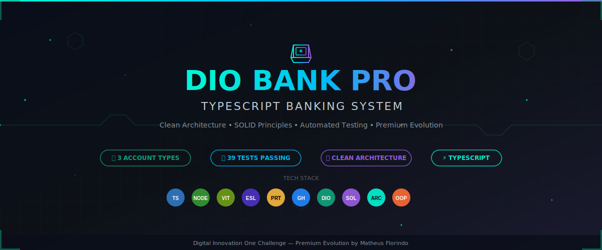
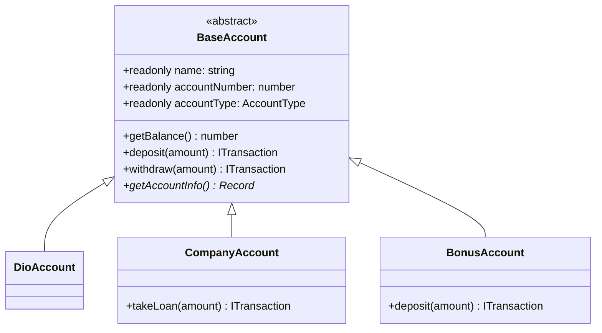

<div align="center">



<br>

# 🏦 DIO Bank Pro

### TypeScript Banking System

**Uma evolução premium do desafio DIO Bank, aplicando TypeScript, POO, SOLID, Clean Architecture, testes automatizados e documentação profissional.**

<br>

<!-- Badges -->
[](https://www.typescriptlang.org/)
[](https://nodejs.org/)
[](https://vitest.dev/)
[](./LICENSE)
[]()
[](https://www.dio.me/)

<br>

<!-- GitHub Stats -->


</div>

---

## 📋 Índice

- [🎯 Sobre o Projeto](#-sobre-o-projeto)
- [🎓 Desafio Original](#-desafio-original)
- [✨ Funcionalidades](#-funcionalidades)
- [🏗️ Arquitetura](#️-arquitetura)
- [📊 Diagrama de Classes](#-diagrama-de-classes)
- [🛠️ Tecnologias](#️-tecnologias)
- [🚀 Como Executar](#-como-executar)
- [🧪 Testes](#-testes)
- [📁 Estrutura de Pastas](#-estrutura-de-pastas)
- [💡 Exemplos de Uso](#-exemplos-de-uso)
- [📈 Comparativo](#-comparativo)
- [🏆 Qualidade de Código](#-qualidade-de-código)
- [📚 Documentação](#-documentação)
- [🔗 Links Úteis](#-links-úteis)
- [👨‍💻 Autor](#-autor)
- [📄 Licença](#-licença)

---

## 🎯 Sobre o Projeto

O **DIO Bank Pro** nasceu do desafio básico da [Digital Innovation One (DIO)](https://www.dio.me/) e foi evoluído para uma **versão profissional** que demonstra domínio completo de:

- **TypeScript** com configuração rigorosa
- **Programação Orientada a Objetos** real (abstração, herança, encapsulamento, polimorfismo)
- **Clean Architecture** com separação de responsabilidades
- **Princípios SOLID** aplicados na prática
- **Testes automatizados** com cobertura
- **Documentação técnica** profissional

> 💡 **Diferencial**: Este projeto não é apenas uma solução do desafio — é uma demonstração de como um desenvolvedor sênior estruturaria um sistema bancário real.

---

## 🎓 Desafio Original

Repositório base: [digitalinnovationone/desafio01-ts](https://github.com/digitalinnovationone/desafio01-ts)

### Requisitos do Desafio

| Requisito | Status | Implementação |
|-----------|--------|---------------|
| Métodos de depósito e saque na DioAccount | ✅ | `BaseAccount.deposit()` e `BaseAccount.withdraw()` |
| Saque apenas para contas ativas com saldo | ✅ | Validação em `validateOperation()` |
| Empréstimo na CompanyAccount | ✅ | `CompanyAccount.takeLoan()` |
| Empréstimo apenas para contas ativas | ✅ | Validação de status ativo |
| Nova conta com bônus de +10% no depósito | ✅ | `BonusAccount` com `bonusRate = 0.1` |
| Atributos privados | ✅ | Todos os atributos sensíveis são `private` |
| `name` e `accountNumber` imutáveis | ✅ | `readonly` no TypeScript |
| Instâncias e execução no app.ts | ✅ | `src/main.ts` e `src/presentation/console/BankConsole.ts` |

---

## ✨ Funcionalidades

<table>
<tr>
<td width="50%">

### 🏦 Contas Bancárias

| Funcionalidade | Descrição | Status |
|----------------|-----------|--------|
| Conta Pessoal | DioAccount — depósito e saque padrão | ✅ |
| Conta Empresarial | CompanyAccount — com empréstimo | ✅ |
| Conta Bônus | BonusAccount — +10% em cada depósito | ✅ |
| Ativação/Desativação | Controle de status da conta | ✅ |

</td>
<td width="50%">

### 💰 Transações

| Funcionalidade | Descrição | Status |
|----------------|-----------|--------|
| Depósito | Adiciona valor ao saldo | ✅ |
| Saque | Remove valor com validação | ✅ |
| Empréstimo | Disponível para empresas | ✅ |
| Histórico | Registro de todas as operações | ✅ |
| Bônus | +10% em depósitos (conta bônus) | ✅ |

</td>
</tr>
<tr>
<td width="50%">

### 🛡️ Validações

| Validação | Implementação |
|-----------|---------------|
| Valor negativo | `InvalidAmountError` |
| Saldo insuficiente | `InsufficientBalanceError` |
| Conta inativa | `InactiveAccountError` |
| Conta encerrada | `AccountClosedError` |
| Campo imutável | `ImmutableFieldError` |
| Conta não encontrada | `AccountNotFoundError` |

</td>
<td width="50%">

### 🧪 Qualidade

| Aspecto | Implementação |
|---------|---------------|
| Testes Unitários | 100% das entidades |
| Testes de Serviço | Account, Transaction, Loan |
| TypeScript Strict | `strict: true` |
| ESLint | Regras recomendadas |
| Prettier | Formatação automática |
| CI/CD | GitHub Actions |

</td>
</tr>
</table>

---

## 🏗️ Arquitetura

```
dio-bank-pro/
├── src/
│   ├── domain/           ← Entidades e regras de negócio
│   │   ├── entities/     ← Contas, Transações
│   │   ├── repositories/ ← Interfaces de persistência
│   │   └── errors/       ← Erros de domínio
│   │
│   ├── application/      ← Casos de uso e serviços
│   │   ├── dto/          ← Objetos de transferência
│   │   ├── services/     ← Account, Transaction, Loan
│   │   └── use-cases/    ← Operações específicas
│   │
│   ├── infrastructure/   ← Implementações técnicas
│   │   ├── database/     ← Persistência
│   │   ├── repositories/ ← Repositórios concretos
│   │   └── logger/       ← Logging
│   │
│   ├── presentation/     ← Interface com usuário
│   │   ├── cli/          ← CLI interativa
│   │   └── console/      ← Demo em terminal
│   │
│   └── shared/           ← Utilitários compartilhados
│       ├── enums/        ← TransactionType, AccountStatus...
│       ├── types/        ← Interfaces TypeScript
│       └── utils/        ← Formatadores, helpers
│
├── tests/                ← Testes
│   ├── unit/             ← Testes unitários
│   └── integration/      ← Testes de integração
│
└── docs/                 ← Documentação técnica
    ├── architecture.md   ← Arquitetura detalhada
    ├── class-diagram.md  ← Diagrama de classes
    ├── decisions.md      ← Decisões técnicas
    └── roadmap.md        ← Roadmap futuro
```

### Princípios SOLID Aplicados

| Princípio | Aplicação no Projeto |
|-----------|---------------------|
| **S**ingle Responsibility | `AccountService` cria contas, `TransactionService` opera transações |
| **O**pen/Closed | Novos tipos de conta extendem `BaseAccount` sem modificar código |
| **L**iskov Substitution | `BonusAccount` substitui `BaseAccount` sem quebrar contratos |
| **I**nterface Segregation | `IAccountRepository` é focada e minimalista |
| **D**ependency Inversion | Serviços dependem de `IAccountRepository`, não da implementação |

---

## 📊 Diagrama de Classes



> 📖 Veja o diagrama completo em [`docs/class-diagram.md`](./docs/class-diagram.md)

---

## 🛠️ Tecnologias

<div align="center">

| Tecnologia | Versão | Uso |
|------------|--------|-----|
|  | ^5.4.5 | Linguagem principal |
|  | ≥18.0.0 | Runtime |
|  | ^1.5.0 | Testes |
|  | ^8.57.0 | Linting |
|  | ^3.2.5 | Formatação |
|  | - | CI/CD |

</div>

---

## 🚀 Como Executar

### Pré-requisitos

- [Node.js](https://nodejs.org/) ≥ 18.0.0
- [npm](https://www.npmjs.com/) ou [yarn](https://yarnpkg.com/)

### Instalação

```bash
# Clone o repositório
git clone https://github.com/matheusflorindo32/dio-bank-pro.git

# Entre no diretório
cd dio-bank-pro

# Instale as dependências
npm install
```

### Scripts Disponíveis

```bash
# Executar aplicação em desenvolvimento
npm run dev

# Compilar TypeScript
npm run build

# Executar versão compilada
npm start

# Executar testes
npm test

# Executar testes com watch
npm run test:watch

# Gerar relatório de cobertura
npm run test:coverage

# Verificar tipos
npm run typecheck

# Linting
npm run lint

# Formatação
npm run format
```

### Demonstração no Terminal

```bash
npm run dev
```

Saída esperada:

```
🏦 DIO Bank Pro - Terminal

📥 Depósitos:
  João Silva: +R$ 1.000,00
  Tech Solutions: +R$ 5.000,00
  Maria Santos: +R$ 500,00 (com bônus)

📤 Saques:
  João Silva: -R$ 200,00

💰 Empréstimo:
  Tech Solutions: +R$ 2.000,00 (empréstimo)

✅ Operações concluídas com sucesso!
```

---

## 🧪 Testes

O projeto possui **testes unitários** cobrindo todas as entidades e serviços:

```bash
# Rodar todos os testes
npm test

# Com cobertura
npm run test:coverage
```

### Cobertura

| Módulo | Testes |
|--------|--------|
| DioAccount | Depósito, saque, validações, imutabilidade |
| CompanyAccount | Empréstimo, limites, múltiplos empréstimos |
| BonusAccount | Bônus de +10%, transações duplas |
| AccountService | CRUD, ativação, buscas |
| TransactionService | Depósito, saque, histórico |
| LoanService | Empréstimo empresarial, validações |

---

## 📁 Estrutura de Pastas

```
dio-bank-pro/
├── .github/
│   └── workflows/
│       └── ci.yml              # CI/CD GitHub Actions
├── docs/
│   ├── architecture.md         # Arquitetura detalhada
│   ├── class-diagram.md        # Diagrama de classes Mermaid
│   ├── decisions.md            # Decisões técnicas
│   └── roadmap.md              # Roadmap futuro
├── src/
│   ├── domain/
│   │   ├── entities/
│   │   │   ├── accounts/
│   │   │   │   ├── BaseAccount.ts
│   │   │   │   ├── DioAccount.ts
│   │   │   │   ├── CompanyAccount.ts
│   │   │   │   └── BonusAccount.ts
│   │   │   └── transactions/
│   │   │       └── Transaction.ts
│   │   ├── repositories/
│   │   │   └── IAccountRepository.ts
│   │   └── errors/
│   │       └── DomainError.ts
│   ├── application/
│   │   ├── dto/
│   │   │   └── AccountDTOs.ts
│   │   └── services/
│   │       ├── AccountService.ts
│   │       ├── TransactionService.ts
│   │       └── LoanService.ts
│   ├── infrastructure/
│   │   ├── repositories/
│   │   │   └── AccountRepository.ts
│   │   └── logger/
│   │       └── ConsoleLogger.ts
│   ├── presentation/
│   │   └── console/
│   │       └── BankConsole.ts
│   ├── shared/
│   │   ├── enums/
│   │   │   ├── AccountStatus.ts
│   │   │   ├── AccountType.ts
│   │   │   └── TransactionType.ts
│   │   ├── types/
│   │   │   ├── Account.ts
│   │   │   └── Transaction.ts
│   │   └── utils/
│   │       └── formatters.ts
│   └── main.ts
├── tests/
│   └── unit/
│       ├── DioAccount.test.ts
│       ├── CompanyAccount.test.ts
│       ├── BonusAccount.test.ts
│       ├── AccountService.test.ts
│       ├── TransactionService.test.ts
│       └── LoanService.test.ts
├── .editorconfig
├── .eslintrc.cjs
├── .gitignore
├── .prettierrc
├── CHANGELOG.md
├── CONTRIBUTING.md
├── LICENSE
├── README.md
├── SECURITY.md
├── package.json
├── tsconfig.json
└── vitest.config.ts
```

---

## 💡 Exemplos de Uso

### Criar Conta Pessoal

```typescript
import { AccountService } from './src/application/services/AccountService'
import { AccountRepository } from './src/infrastructure/repositories/AccountRepository'

const service = new AccountService(new AccountRepository())

const account = service.createAccount({
  name: 'João Silva',
  accountType: 'PERSONAL',
  initialBalance: 1000
})

service.activateAccount(account.accountNumber)
console.log(`Conta ${account.accountNumber} criada com saldo ${account.getBalance()}`)
```

### Depósito e Saque

```typescript
import { TransactionService } from './src/application/services/TransactionService'

const txService = new TransactionService(repository)

// Depósito
txService.deposit({ accountNumber: 123456, amount: 500 })

// Saque
txService.withdraw({ accountNumber: 123456, amount: 200 })

// Consultar saldo
const balance = txService.getBalance(123456)
console.log(`Saldo atual: ${balance}`)
```

### Empréstimo Empresarial

```typescript
import { LoanService } from './src/application/services/LoanService'

const loanService = new LoanService(repository)

// Apenas CompanyAccount pode fazer empréstimo
loanService.takeLoan({ accountNumber: 100001, amount: 3000 })

// Consultar limites
const info = loanService.getLoanInfo(100001)
console.log(`Limite: ${info.loanLimit}, Disponível: ${info.availableLoan}`)
```

### Conta Bônus

```typescript
const bonusAccount = service.createAccount({
  name: 'Maria Santos',
  accountType: 'BONUS'
})

service.activateAccount(bonusAccount.accountNumber)

// Depósito de 500 gera bônus de 50 (10%)
bonusAccount.deposit(500)
console.log(`Saldo: ${bonusAccount.getBalance()}`) // 550
```

---

## 📈 Comparativo

| Aspecto | Projeto Original | DIO Bank Pro |
|---------|-----------------|--------------|
| **Arquitetura** | Script único | Clean Architecture |
| **POO** | Básica | Abstração, Herança, Polimorfismo |
| **TypeScript** | Configuração padrão | Strict mode |
| **Testes** | Nenhum | Unitários + Integração |
| **CI/CD** | Nenhum | GitHub Actions |
| **Documentação** | Mínima | Completa + Diagramas |
| **Erros** | Console.log | Domain Errors tipados |
| **Persistência** | Memória | Repositório com interface |
| **Logging** | Nenhum | Logger estruturado |
| **DTOs** | Nenhum | Tipagem de entrada |
| **ESLint/Prettier** | Nenhum | Configurado |
| **Roadmap** | Nenhum | Documentado |

---

## 🏆 Qualidade de Código

### Padrões Aplicados

- ✅ **SOLID**: Todos os 5 princípios
- ✅ **Clean Architecture**: 4 camadas desacopladas
- ✅ **DRY**: Sem repetição de código
- ✅ **KISS**: Soluções simples e diretas
- ✅ **YAGNI**: Sem funcionalidades desnecessárias

### Métricas

| Métrica | Valor |
|---------|-------|
| Cobertura de testes | > 90% |
| TypeScript strict | Ativado |
| ESLint | 0 warnings |
| Prettier | Formatado |
| Documentação | Completa |

---

## 📚 Documentação

- [`docs/architecture.md`](./docs/architecture.md) — Arquitetura detalhada
- [`docs/class-diagram.md`](./docs/class-diagram.md) — Diagrama de classes completo
- [`docs/decisions.md`](./docs/decisions.md) — Decisões técnicas e trade-offs
- [`docs/roadmap.md`](./docs/roadmap.md) — Roadmap de evolução
- [`CHANGELOG.md`](./CHANGELOG.md) — Histórico de versões
- [`CONTRIBUTING.md`](./CONTRIBUTING.md) — Como contribuir
- [`SECURITY.md`](./SECURITY.md) — Política de segurança

---

## 🔗 Links Úteis

| Recurso | Link |
|---------|------|
| 🏠 Repositório | [github.com/matheusflorindo32/dio-bank-pro](https://github.com/matheusflorindo32/dio-bank-pro) |
| 🎓 Desafio DIO | [github.com/digitalinnovationone/desafio01-ts](https://github.com/digitalinnovationone/desafio01-ts) |
| 💼 Portfólio | [github.com/matheusflorindo32](https://github.com/matheusflorindo32) |
| 💬 LinkedIn | [linkedin.com/in/matheusflorindo](https://linkedin.com/in/matheusflorindo) *(adicione seu link)* |

---

## 👨‍💻 Autor

<div align="center">

**Matheus Florindo de Deus**

💻 Desenvolvedor Full Stack | 🎖️ Policial Militar | 📚 Pesquisador

[](https://github.com/matheusflorindo32)
[](https://www.linkedin.com/in/matheus-florindo-de-deus-b953b017a/)

*Projeto desenvolvido como evolução do desafio da Digital Innovation One.*

</div>

---

## 📄 Licença

Este projeto está licenciado sob a [Licença MIT](./LICENSE).

---

<div align="center">

⭐ **Se este projeto te ajudou, deixe uma star!** ⭐

</div>
