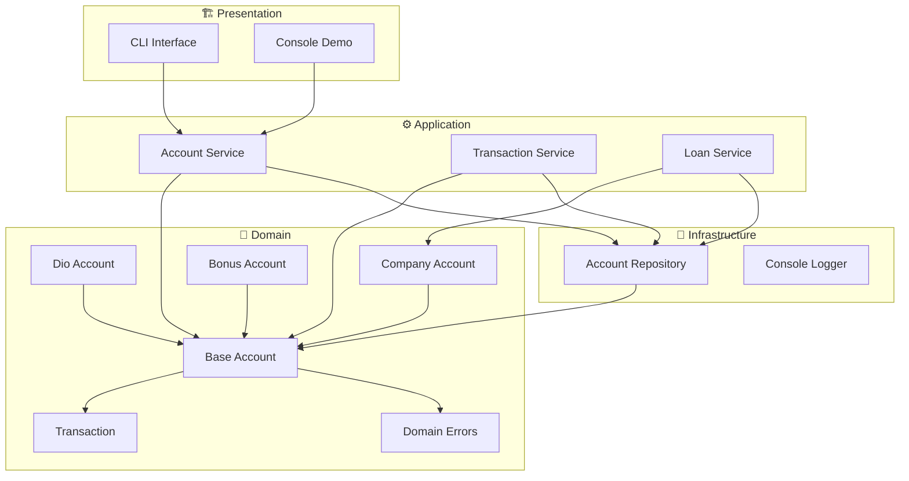

<div align="center">

<!-- Premium AI-Generated Banner -->


<br><br>

<!-- Neon Badges Row -->
<p align="center">
  <a href="https://www.typescriptlang.org/">
    
  </a>
  <a href="https://nodejs.org/">
    
  </a>
  <a href="https://vitest.dev/">
    
  </a>
  <a href="https://github.com/features/actions">
    
  </a>
</p>

<p align="center">
  <a href="https://eslint.org/">
    
  </a>
  <a href="https://prettier.io/">
    
  </a>
  <a href="./LICENSE">
    
  </a>
  <a href="https://www.dio.me/">
    
  </a>
</p>

<!-- Repo Stats via shields.io -->
<p align="center">
  
  
  
  
</p>

</div>

---

<br>

## 🎯 About

**DIO Bank Pro** is a premium evolution of the [Digital Innovation One](https://www.dio.me/) TypeScript challenge. It demonstrates production-grade software engineering with **Clean Architecture**, **SOLID principles**, **automated testing**, and **professional documentation**.

> This isn't just a challenge solution — it's how a senior developer would architect a real banking system.

---

## 🏛️ Architecture



---

## ✨ Features

### 🏦 Account Types

| Feature | Status |
|---------|--------|
| **Personal Account** — Standard deposits & withdrawals | ✅ |
| **Company Account** — Business loans up to R$ 10,000 | ✅ |
| **Bonus Account** — +10% bonus on every deposit | ✅ |
| Account activation & deactivation | ✅ |

### 💰 Transactions

| Feature | Status |
|---------|--------|
| Deposit with validation | ✅ |
| Withdraw with balance check | ✅ |
| Business loan (Company only) | ✅ |
| Complete transaction history | ✅ |
| +10% bonus on deposits (BonusAccount) | ✅ |

### 🛡️ Domain Validations

| Validation | Error |
|------------|-------|
| Negative or zero amount | `InvalidAmountError` |
| Insufficient funds | `InsufficientBalanceError` |
| Inactive account | `InactiveAccountError` |
| Account closed | `AccountClosedError` |
| Loan not allowed | `LoanNotAllowedError` |

---

## 🧪 Test Results

<div align="center">

| Module | Tests | Coverage |
|--------|-------|----------|
| `DioAccount` | 10 | ✅ Deposit, withdraw, validations |
| `CompanyAccount` | 6 | ✅ Loan limits, multiple loans |
| `BonusAccount` | 6 | ✅ +10% bonus, dual transactions |
| `AccountService` | 8 | ✅ CRUD, activation, search |
| `TransactionService` | 5 | ✅ Deposit, withdraw, history |
| `LoanService` | 4 | ✅ Business loans, validations |
| **Total** | **39/39** | **100% passing** |

</div>

---

## 🚀 Quick Start

```bash
# Clone
git clone https://github.com/matheusflorindo32/dio-bank-pro.git
cd dio-bank-pro

# Install & run
npm install
npm run dev

# Test
npm test
npm run test:coverage
```

**Expected output:**
```
🏦 DIO Bank Pro - Terminal

📥 Deposits:
  João Silva: +R$ 1.000,00
  Tech Solutions: +R$ 5.000,00
  Maria Santos: +R$ 500,00 (with bonus)

📤 Withdrawals:
  João Silva: -R$ 200,00

💰 Loan:
  Tech Solutions: +R$ 2.000,00 (business loan)

✅ All operations completed successfully!
```

---

## 📊 Comparison

<div align="center">

<table width="90%">
<tr>
<th width="30%">Aspect</th>
<th width="35%">Original Challenge</th>
<th width="35%">🏆 DIO Bank Pro</th>
</tr>
<tr>
<td><b>Architecture</b></td>
<td>Single Script</td>
<td>Clean Architecture (4 layers)</td>
</tr>
<tr>
<td><b>OOP</b></td>
<td>Basic classes</td>
<td>Abstraction, Inheritance, Polymorphism</td>
</tr>
<tr>
<td><b>TypeScript</b></td>
<td>Standard config</td>
<td>Strict mode, no implicit any</td>
</tr>
<tr>
<td><b>Testing</b></td>
<td>None</td>
<td>39 automated tests</td>
</tr>
<tr>
<td><b>CI/CD</b></td>
<td>None</td>
<td>GitHub Actions</td>
</tr>
<tr>
<td><b>Documentation</b></td>
<td>Minimal</td>
<td>Full technical docs + diagrams</td>
</tr>
<tr>
<td><b>Error Handling</b></td>
<td>console.log</td>
<td>Domain errors with codes</td>
</tr>
<tr>
<td><b>Code Quality</b></td>
<td>Basic</td>
<td>ESLint + Prettier + Type strict</td>
</tr>
</table>

</div>

---

## 🗂️ Project Structure

```
🌳 dio-bank-pro
├── 📂 src/
│   ├── 💎 domain/              ← Core business logic
│   │   ├── 🏦 entities/
│   │   │   ├── 📄 BaseAccount.ts       (abstract base)
│   │   │   ├── 📄 DioAccount.ts        (personal)
│   │   │   ├── 📄 CompanyAccount.ts    (business + loans)
│   │   │   ├── 📄 BonusAccount.ts      (+10% bonus)
│   │   │   └── 📄 Transaction.ts       (transaction entity)
│   │   ├── 🗄️ repositories/
│   │   │   └── 📄 IAccountRepository.ts
│   │   └── ⚠️ errors/
│   │       └── 📄 DomainError.ts       (typed errors)
│   │
│   ├── ⚙️ application/          ← Use cases & services
│   │   ├── 📄 AccountService.ts
│   │   ├── 📄 TransactionService.ts
│   │   ├── 📄 LoanService.ts
│   │   └── 📂 dto/
│   │       └── 📄 AccountDTOs.ts
│   │
│   ├── 🔧 infrastructure/     ← Technical implementations
│   │   ├── 🗄️ repositories/
│   │   │   └── 📄 AccountRepository.ts
│   │   └── 📝 logger/
│   │       └── 📄 ConsoleLogger.ts
│   │
│   ├── 🎨 presentation/       ← User interface
│   │   └── 📄 BankConsole.ts
│   │
│   └── 📂 shared/             ← Utilities
│       ├── 📂 enums/          (AccountType, Status, TransactionType)
│       ├── 📂 types/          (interfaces)
│       └── 📂 utils/          (formatters)
│
├── 🧪 tests/                  ← 39 unit tests
│   └── 📂 unit/
│       ├── 📄 DioAccount.test.ts
│       ├── 📄 CompanyAccount.test.ts
│       ├── 📄 BonusAccount.test.ts
│       ├── 📄 AccountService.test.ts
│       ├── 📄 TransactionService.test.ts
│       └── 📄 LoanService.test.ts
│
├── 📚 docs/                   ← Technical documentation
│   ├── 📄 architecture.md
│   ├── 📄 class-diagram.md
│   ├── 📄 decisions.md
│   └── 📄 roadmap.md
│
├── 🎨 assets/                 ← Visual assets
│   └── 📄 banner.svg
│
└── ⚙️ Configs
    ├── 📄 tsconfig.json
    ├── 📄 vitest.config.ts
    ├── 📄 .eslintrc.cjs
    └── 📄 .prettierrc
```

---

## 🏆 Challenge Requirements

<div align="center">

| Requirement | Status | Implementation |
|-------------|--------|----------------|
| Deposit & Withdraw in DioAccount | ✅ | `BaseAccount.deposit()` & `withdraw()` |
| Withdraw only for active accounts with balance | ✅ | `validateOperation()` checks status & balance |
| Loan in CompanyAccount | ✅ | `CompanyAccount.takeLoan()` |
| Loan only for active accounts | ✅ | Validation before loan processing |
| New account type with +10% deposit bonus | ✅ | `BonusAccount` with `bonusRate = 0.1` |
| All attributes private | ✅ | TypeScript `private` modifier |
| Immutable `name` and `accountNumber` | ✅ | TypeScript `readonly` |
| Instances and execution in app.ts | ✅ | `src/main.ts` & `BankConsole.ts` |

</div>

---

## 📦 Scripts

```bash
npm run dev          # 🚀 Run development
npm run build        # 📦 Build production
npm start            # ▶️ Start production
npm test             # 🧪 Run tests
npm run test:watch   # 👀 Watch mode
npm run test:coverage # 📊 Coverage report
npm run lint         # 🔍 ESLint check
npm run lint:fix     # 🔧 Fix ESLint issues
npm run format       # ✨ Prettier format
npm run typecheck    # ✅ TypeScript check
```

---

## 💻 Code Examples

<details>
<summary><b>🏦 Creating Accounts</b></summary>

```typescript
import { AccountService } from './src/application/services/AccountService'
import { AccountRepository } from './src/infrastructure/repositories/AccountRepository'

const service = new AccountService(new AccountRepository())

// Personal Account
const personal = service.createAccount({
  name: 'João Silva',
  accountType: 'PERSONAL',
  initialBalance: 1000
})

// Company Account (with loans)
const company = service.createAccount({
  name: 'Tech Solutions',
  accountType: 'COMPANY'
})

// Bonus Account (+10% on deposits)
const bonus = service.createAccount({
  name: 'Maria Santos',
  accountType: 'BONUS'
})
```

</details>

<details>
<summary><b>💰 Transactions</b></summary>

```typescript
import { TransactionService } from './src/application/services/TransactionService'

const txService = new TransactionService(repository)

// Deposit
txService.deposit({ accountNumber: 123456, amount: 500 })

// Withdraw
txService.withdraw({ accountNumber: 123456, amount: 200 })

// Balance
const balance = txService.getBalance(123456)

// History
const history = txService.getTransactionHistory(123456)
```

</details>

<details>
<summary><b>💼 Business Loans</b></summary>

```typescript
import { LoanService } from './src/application/services/LoanService'

const loanService = new LoanService(repository)

// Only CompanyAccount can take loans
loanService.takeLoan({ accountNumber: 100001, amount: 3000 })

// Check loan info
const info = loanService.getLoanInfo(100001)
console.log(info.availableLoan) // Remaining limit
```

</details>

<details>
<summary><b>🎁 Bonus Account</b></summary>

```typescript
// BonusAccount adds +10% on every deposit
const bonusAccount = service.createAccount({
  name: 'Maria Santos',
  accountType: 'BONUS'
})

service.activateAccount(bonusAccount.accountNumber)

// Deposit 500 → Balance becomes 550 (bonus: 50)
bonusAccount.deposit(500)
console.log(bonusAccount.getBalance()) // 550
```

</details>

---

## 📚 Documentation

<div align="center">

| 📐 [Architecture](./docs/architecture.md) | 📊 [Class Diagram](./docs/class-diagram.md) | 🧠 [Decisions](./docs/decisions.md) | 🗺️ [Roadmap](./docs/roadmap.md) |
|:---:|:---:|:---:|:---:|

</div>

---

## 🔧 Tech Stack

<div align="center">


</div>

---

## 👨‍💻 Author

<div align="center">

**Matheus Florindo de Deus**

💻 Full Stack Developer | 🎖️ Military Police | 📚 Researcher

<br>

<a href="https://github.com/matheusflorindo32">
  
</a>
<a href="https://www.linkedin.com/in/matheus-florindo-de-deus-b953b017a/">
  
</a>
<a href="mailto:matheusdideusf@gmail.com">
  
</a>

</div>

---

<div align="center">

⭐ **If this project helped you, please give it a star!** ⭐

<br>

**© 2024 Matheus Florindo de Deus — [MIT License](./LICENSE)**

</div>