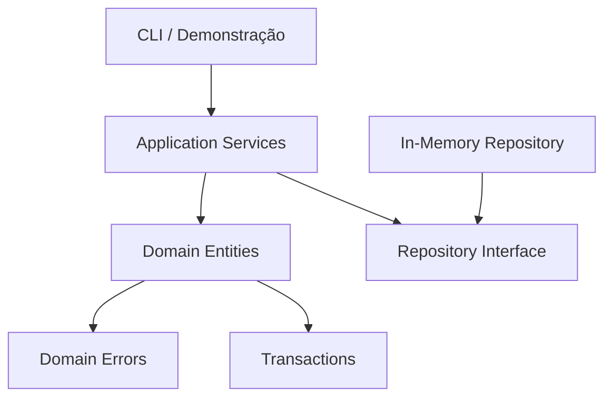

<div align="center">


# DIO BANK PRO

### Sistema bancário educacional em TypeScript com separação de camadas e testes automatizados

[](https://www.typescriptlang.org/)
[](https://nodejs.org/)
[](https://vitest.dev/)
[](https://www.dio.me/)

</div>

---

## Visão geral

O **DIO Bank Pro** é uma evolução educacional de um desafio de orientação a objetos em TypeScript.

O projeto foi reorganizado para demonstrar:

- entidades de domínio;
- serviços de aplicação;
- repositório em memória;
- erros específicos de negócio;
- princípios SOLID;
- tipagem estrita;
- testes automatizados;
- automação de qualidade com GitHub Actions.

Ele deve ser entendido como **projeto de estudo e portfólio**, não como sistema financeiro real.

---

## Funcionalidades

### Tipos de conta

- conta pessoal;
- conta empresarial com empréstimo;
- conta bônus com acréscimo sobre depósitos;
- ativação e desativação de contas.

### Operações

- depósito;
- saque;
- consulta de saldo;
- histórico de transações;
- empréstimo para contas empresariais;
- validações de domínio.

### Erros tratados

- valor inválido;
- saldo insuficiente;
- conta inativa;
- conta encerrada;
- empréstimo não permitido.

---

## Arquitetura


```mermaid
graph TD
    A[CLI / Demonstração] --> B[Application Services]
    B --> C[Domain Entities]
    B --> D[Repository Interface]
    E[In-Memory Repository] --> D
    C --> F[Domain Errors]
    C --> G[Transactions]
```

| Camada | Responsabilidade |
|:---|:---|
| **Presentation** | demonstração em terminal |
| **Application** | casos de uso e coordenação |
| **Domain** | regras, entidades, erros e transações |
| **Infrastructure** | armazenamento em memória e logging |

---

## Testes

O README original do projeto documenta **39 testes automatizados** cobrindo contas, serviços, depósitos, saques, empréstimos e validações.

Para verificar no ambiente local:

```bash
npm test
```

Para cobertura:

```bash
npm run test:coverage
```

A métrica deve ser tratada como verificável apenas quando reproduzida pela suíte atual do repositório.

---

## Execução local

```bash
git clone https://github.com/matheusflorindo32/dio-bank-pro.git
cd dio-bank-pro
npm install
npm run dev
```

### Qualidade

```bash
npm test
npm run lint
```

Consulte o `package.json` para os scripts disponíveis na versão atual.

---

## Stack

`TypeScript` • `Node.js` • `Vitest` • `ESLint` • `Prettier` • `GitHub Actions`

---

## Decisões técnicas

- separação entre regras de negócio e infraestrutura;
- herança apenas onde o domínio exige comportamento comum;
- erros de domínio em vez de mensagens genéricas;
- serviços para evitar concentração de lógica na interface;
- repositório em memória para manter o foco no aprendizado arquitetural;
- testes para regras críticas.

---

## Limitações

- não utiliza banco de dados;
- não possui autenticação;
- não processa dinheiro real;
- não atende requisitos regulatórios ou de segurança bancária;
- não deve ser usado como base direta para operação financeira.

---

## Autor

**Matheus Florindo de Deus**  
Estudante de Análise e Desenvolvimento de Sistemas — IFES

[](https://github.com/matheusflorindo32)
[](https://www.tropacientifica.com)

---

## Licença

Consulte o arquivo [LICENSE](LICENSE).
