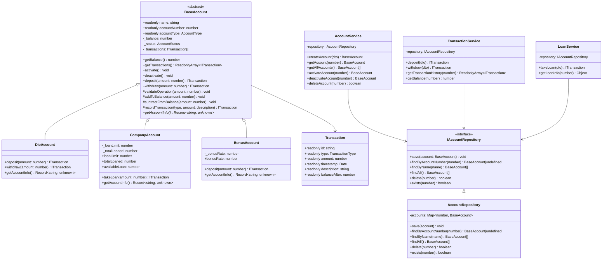

# Diagrama de Classes

```mermaid
classDiagram
    class BaseAccount {
        <<abstract>>
        +readonly name: string
        +readonly accountNumber: number
        +readonly accountType: AccountType
        -_balance: number
        -_status: AccountStatus
        -_transactions: ITransaction[]
        +getBalance() number
        +getTransactions() ReadonlyArray~ITransaction~
        +activate() void
        +deactivate() void
        +deposit(amount: number) ITransaction
        +withdraw(amount: number) ITransaction
        #validateOperation(amount: number) void
        #addToBalance(amount: number) void
        #subtractFromBalance(amount: number) void
        #recordTransaction(type, amount, description) ITransaction
        +getAccountInfo()* Record~string, unknown~
    }

    class DioAccount {
        +deposit(amount: number) ITransaction
        +withdraw(amount: number) ITransaction
        +getAccountInfo() Record~string, unknown~
    }

    class CompanyAccount {
        -_loanLimit: number
        -_totalLoaned: number
        +loanLimit: number
        +totalLoaned: number
        +availableLoan: number
        +takeLoan(amount: number) ITransaction
        +getAccountInfo() Record~string, unknown~
    }

    class BonusAccount {
        -_bonusRate: number
        +bonusRate: number
        +deposit(amount: number) ITransaction
        +getAccountInfo() Record~string, unknown~
    }

    class Transaction {
        +readonly id: string
        +readonly type: TransactionType
        +readonly amount: number
        +readonly timestamp: Date
        +readonly description: string
        +readonly balanceAfter: number
    }

    class IAccountRepository {
        <<interface>>
        +save(account: BaseAccount) void
        +findByAccountNumber(number) BaseAccount|undefined
        +findByName(name) BaseAccount[]
        +findAll() BaseAccount[]
        +delete(number) boolean
        +exists(number) boolean
    }

    class AccountRepository {
        -accounts: Map~number, BaseAccount~
        +save(account) void
        +findByAccountNumber(number) BaseAccount|undefined
        +findByName(name) BaseAccount[]
        +findAll() BaseAccount[]
        +delete(number) boolean
        +exists(number) boolean
    }

    class AccountService {
        -repository: IAccountRepository
        +createAccount(dto) BaseAccount
        +getAccount(number) BaseAccount
        +getAllAccounts() BaseAccount[]
        +activateAccount(number) BaseAccount
        +deactivateAccount(number) BaseAccount
        +deleteAccount(number) boolean
    }

    class TransactionService {
        -repository: IAccountRepository
        +deposit(dto) ITransaction
        +withdraw(dto) ITransaction
        +getTransactionHistory(number) ReadonlyArray~ITransaction~
        +getBalance(number) number
    }

    class LoanService {
        -repository: IAccountRepository
        +takeLoan(dto) ITransaction
        +getLoanInfo(number) Object
    }

    BaseAccount <|-- DioAccount
    BaseAccount <|-- CompanyAccount
    BaseAccount <|-- BonusAccount
    IAccountRepository <|.. AccountRepository
    AccountService --> IAccountRepository
    TransactionService --> IAccountRepository
    LoanService --> IAccountRepository
    BaseAccount --> Transaction
```
